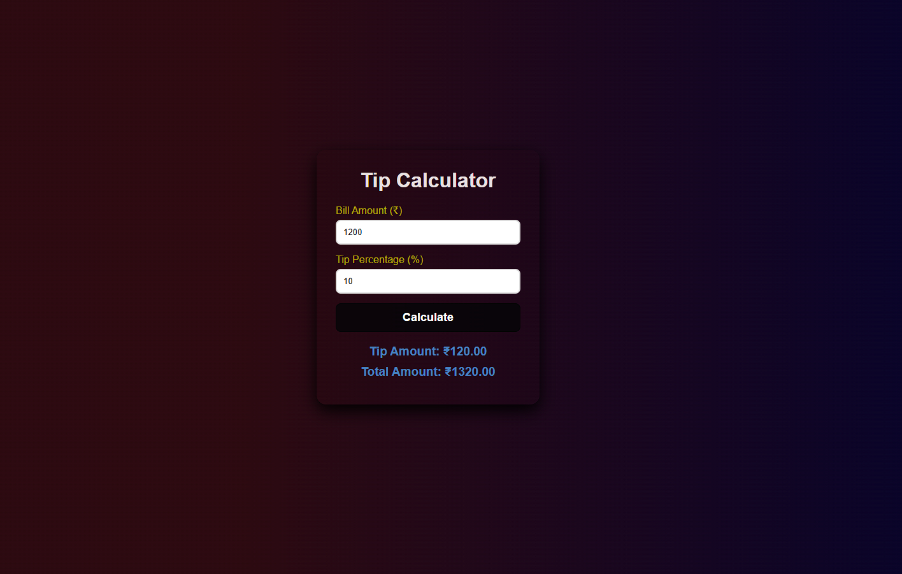

# Tip Calculator

A simple and responsive Tip Calculator built using HTML, CSS, and JavaScript. This application helps users calculate the tip amount and total bill amount quickly and accurately.

## Features

- Calculate tip amount based on bill total
- Display total amount including tip
- Input validation   
- Clean and responsive user interface
- Beginner-friendly project

## Technologies Used

- HTML5
- CSS3
- JavaScript (ES6)

## Project Structure

```text
tip-calculator/
│
├── images/
│   └── screenshot.png
│
├── index.html
├── style.css
├── script.js
└── README.md
```
## Screenshot


